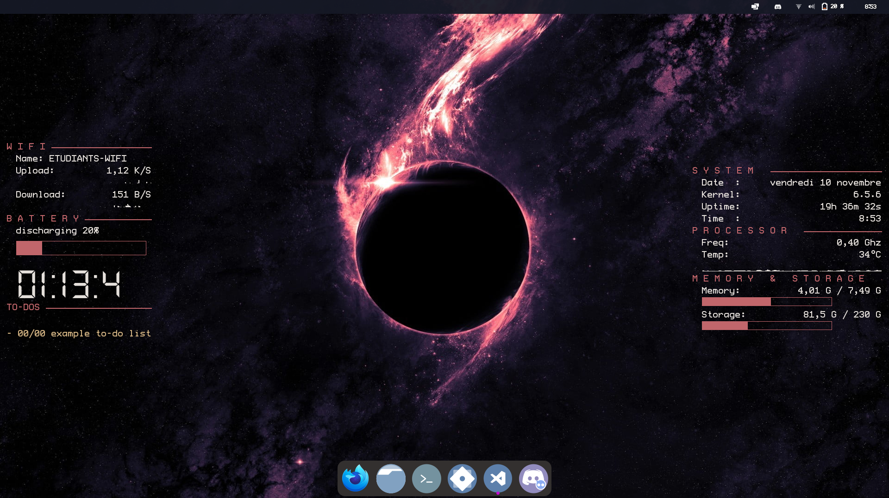
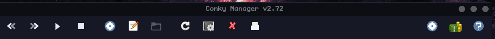
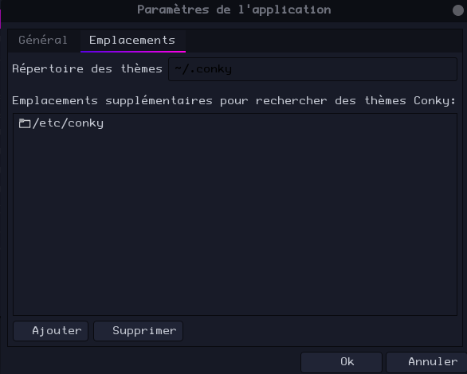
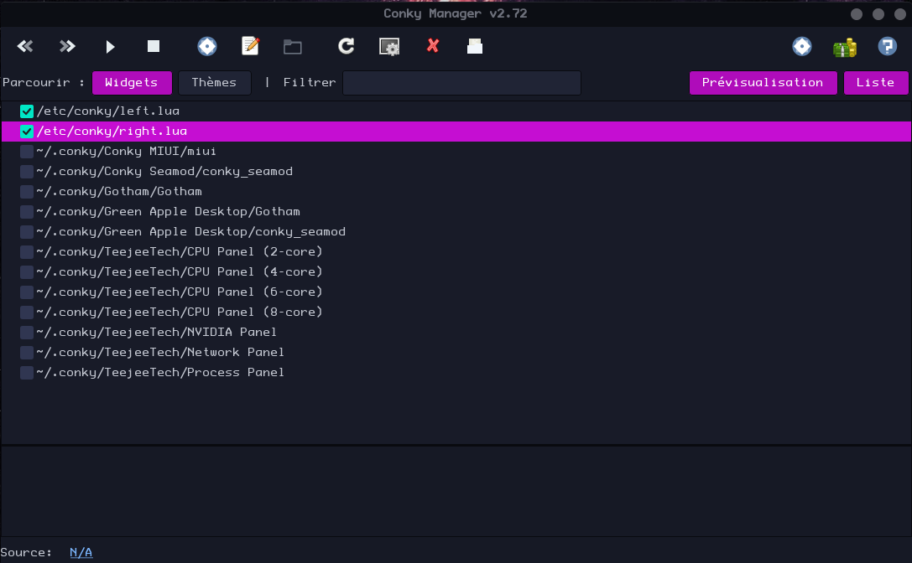
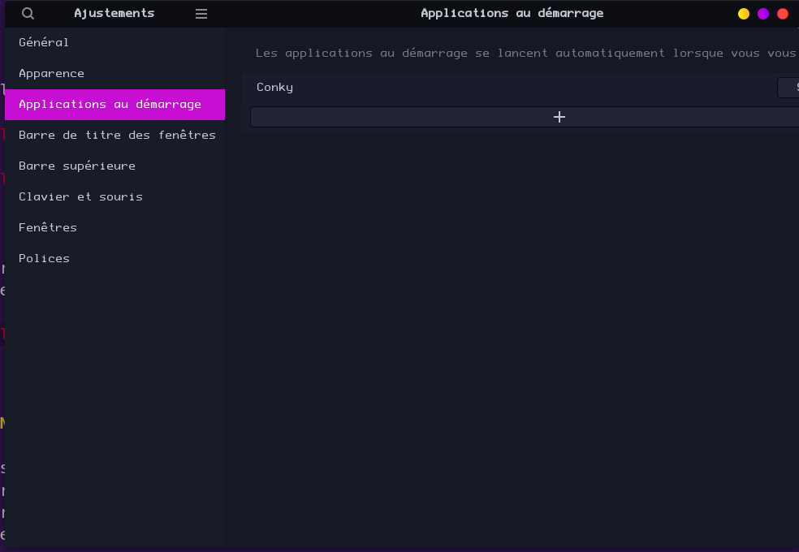

### Conky Dashboard

Ce README décrit les étapes pour configurer Conky sur GNOME. Suivez ces instructions pour obtenir un affichage Conky personnalisé.
<p align="center"></p>

---

### Configuration de Conky pour GNOME

#### Étape 1 : Cloner le référentiel

Clonez le référentiel dans le répertoire `/etc/` en utilisant la commande suivante :

```bash
sudo git clone https://github.com/DonatFortini/Dashboard_gnome_conky 
```

#### Étape 2 : Exécuter le script d'installation des dépendances

Assurez-vous d'exécuter le script d'installation des dépendances pour garantir le bon fonctionnement de Conky. Utilisez la commande :

```bash
./install_script.sh
```
#### Étape 3 : Ajouter `/etc/conky/` aux dossiers de configuration

Dans Conky Manager, ajoutez le répertoire `/etc/conky/` comme source de configurations pour Conky en cliquant sur le bouton parametre.

<p align="center"></p>

<p align="center"></p>

#### Étape 4 : Ajouter `left.lua` et `right.lua` au démarrage

Assurez-vous d'ajouter les fichiers de configuration `left.lua` et `right.lua` au démarrage pour afficher les éléments souhaités dans Conky.

<p align="center"></p>

<p align="center"></p>
---

### Notes supplémentaires

- Assurez-vous que Conky Manager est configuré pour charger les configurations au démarrage de GNOME pour une expérience sans souci. 
- Personnalisez les fichiers `left.lua` et `right.lua` pour afficher les informations que vous souhaitez sur votre bureau.
- L'application Gnome-tweaks est fortement recommandé --> 

```bash
sudo apt install gnome-tweaks
``` 


---

**Remarque :** Assurez-vous d'avoir les autorisations appropriées pour exécuter les actions dans le répertoire `/etc/`. Si nécessaire, utilisez `sudo` pour obtenir les droits d'administration.

---

N'hésitez pas à explorer les fonctionnalités supplémentaires de Conky pour personnaliser davantage votre expérience de bureau. Profitez de votre nouvel affichage Conky sur GNOME !
